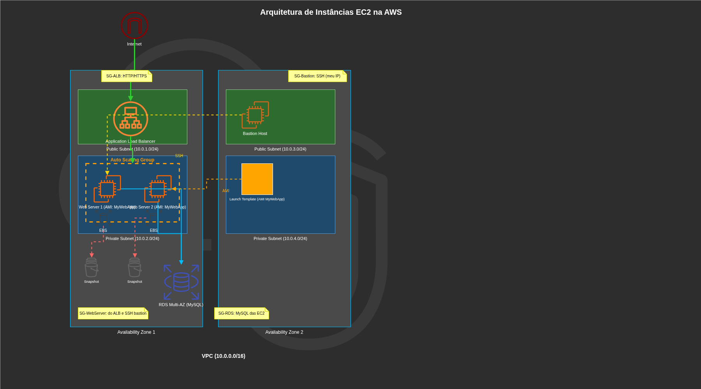

# Desafio DIO – Arquitetura de Instâncias EC2 na AWS

## Objetivo

Documentar o desenho de uma infraestrutura utilizando instâncias EC2, aplicando conceitos de redes, segurança, escalabilidade e alta disponibilidade na AWS.

## Diagrama da Arquitetura

## Componentes e Funcionalidades

### 1. VPC e Internet Gateway

- VPC com bloco CIDR 10.0.0.0/16.
- Internet Gateway para permitir tráfego de entrada e saída da internet.

### 2. Sub-redes e Zonas de Disponibilidade

- **AZ1**:
  - Sub-rede pública (10.0.1.0/24) para o Load Balancer.
  - Sub-rede privada (10.0.2.0/24) para instâncias EC2 e RDS.
- **AZ2**:
  - Sub-rede pública (10.0.3.0/24) para o Bastion Host.
  - Sub-rede privada (10.0.4.0/24) para instâncias EC2 e RDS (Multi-AZ).

### 3. Application Load Balancer (ALB)

- Distribui tráfego HTTP/HTTPS entre as instâncias.
- Localizado na sub-rede pública da AZ1.
- Configurado com Security Group que permite tráfego da internet nas portas 80/443.

### 4. Bastion Host

- Instância EC2 na sub-rede pública da AZ2.
- Usada como "porta de entrada" para administração via SSH.
- Security Group restrito por IP (acesso apenas do meu IP doméstico).

### 5. Auto Scaling Group (ASG) e Launch Template

- Mantém de 1 a 3 instâncias EC2 baseadas na demanda (CPU acima de 70%).
- Instâncias criadas a partir de uma **AMI personalizada** (MyWebApp) referenciada no Launch Template.

### 6. Instâncias EC2 (Servidores Web)

- Localizadas nas sub-redes privadas (AZ1 e AZ2).
- Security Group permite tráfego apenas do ALB (HTTP/HTTPS) e SSH via Bastion.
- Armazenamento em volumes EBS gp3.

### 7. Snapshots EBS

- Snapshots automáticos dos volumes EBS para backup e recuperação.
- Agendados periodicamente (ex: a cada 24h) conforme boas práticas de Disaster Recovery.

### 8. Banco de Dados (RDS Multi-AZ)

- Instância RDS MySQL distribuída nas sub-redes privadas de ambas as AZs.
- Replicação Multi-AZ para failover automático em caso de falha.
- Security Group aceita conexões apenas das instâncias EC2 na porta 3306.

## Considerações de Segurança e Escalabilidade

- Separação entre camadas pública e privada.
- Uso de Security Groups como "mini-firewalls" em cada camada.
- Auto Scaling garante que o sistema suporte picos de tráfego.
- Snapshots EBS e RDS Multi-AZ garantem recuperação de desastres.
- AMI personalizada acelera o lançamento de novas instâncias com a aplicação já configurada.

## Aprendizados

Este laboratório reforçou:

- Criação e gerenciamento de AMIs personalizadas.
- Configuração de VPC, sub-redes e grupos de segurança.
- Integração de EC2 com ALB, Auto Scaling e Launch Templates.
- Implementação de snapshots EBS como estratégia de backup.
- Arquitetura Multi-AZ para alta disponibilidade.
- A importância de documentar a arquitetura para a equipe.

## Como Executar (Opcional)

Caso queira reproduzir esta infraestrutura, utilize o template do CloudFormation ou Terraform disponível na branch `infra-codigo`.
